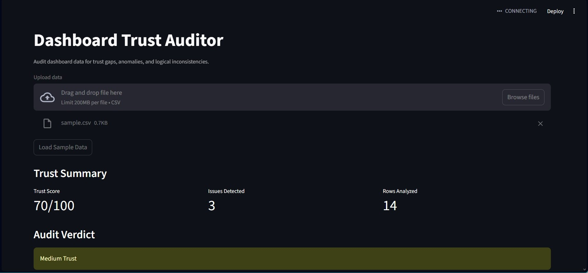
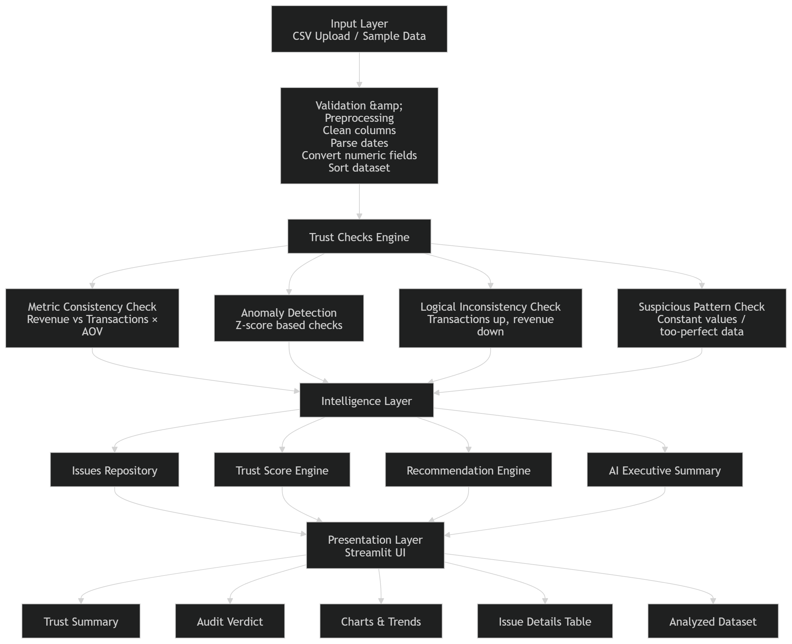

# Dashboard Trust Auditor

An AI-powered tool that audits dashboard reliability by detecting anomalies, metric inconsistencies, and logical trust gaps before they affect business decisions.

## Why this matters

Most dashboards do not fail loudly. They fail silently.

When revenue does not reconcile, related metrics move in conflicting directions, or data appears suspiciously perfect, teams lose trust and start relying on manual workarounds. This tool adds a trust layer on top of analytics systems.

---

## 🚀 Features

- ✅ **Metric Consistency Validation**  
  Ensures relationships like Revenue = Transactions × Average Order Value are accurate.

- 📊 **Anomaly Detection**  
  Identifies unusual patterns using statistical techniques such as z-score analysis.

- ⚠️ **Logical Inconsistency Checks**  
  Flags contradictions across metrics (e.g., rising transactions but declining revenue).

- 📉 **Trust Score Generation**  
  Quantifies dashboard reliability on a scale of 0–100.

- 🤖 **AI-Powered Executive Summaries**  
  Converts technical issues into business-friendly insights using AI.

- 📈 **Interactive Visualizations**  
  Provides intuitive dashboards built with Streamlit.

---

## 🛠️ Tech Stack

- **Python**
- **Pandas**
- **NumPy**
- **Streamlit**
- **OpenAI API**

---

## 📸 Demo

### Dashboard Overview


### Architecture Diagram


---

## 🏗️ Architecture Overview

```plaintext
CSV Upload
    ↓
Data Validation & Preprocessing
    ↓
Trust Checks Engine
(Metric Consistency, Anomaly Detection, Logical Validation)
    ↓
Trust Score & AI Insights
    ↓
Interactive Streamlit Dashboard

```
---

## 🧠 Product Thinking Behind This Build

This project was designed not just as a technical solution, but as a product that balances accuracy, usability, and trust.

### 1️⃣ Why Rules Were Used First Instead of Complex ML
- Ensures transparency and interpretability.
- Delivers immediate value without requiring large datasets.
- Enables rapid prototyping and validation.
- Aligns with real-world product development practices.

**Product Principle:** *Start simple, validate fast, and iterate.*

---

### 2️⃣ Why AI Is Used for Explanation, Not Primary Detection
- AI translates technical findings into business-friendly insights.
- Improves accessibility for non-technical stakeholders.
- Maintains transparency and reduces hallucination risks.
- Ensures auditability and user trust.

**Product Principle:** *Use AI to enhance understanding, not obscure it.*

---

### 3️⃣ What the Trust Score Means for a User
The Trust Score provides a simple, intuitive measure of dashboard reliability.

| Score Range | Trust Level | Meaning |
|-------------|-------------|---------|
| **85–100** | 🟢 High Trust | Data is reliable and decision-ready. |
| **65–84** | 🟡 Medium Trust | Minor issues detected; review recommended. |
| **Below 65** | 🔴 Low Trust | Significant risks present; investigation required. |

**Product Principle:** *Turn complex diagnostics into simple, actionable insights.*

---

## 🛠️ Tech Stack

| Technology | Purpose |
|------------|---------|
| **Python** | Core development |
| **Pandas** | Data processing and analysis |
| **NumPy** | Statistical computations |
| **Streamlit** | Interactive user interface |
| **OpenAI API** | AI-generated summaries |
| **Matplotlib/Plotly** | Data visualizations |

---

## ▶️ How to Run Locally

### 1. Clone the Repository
```bash
git clone https://github.com/aashayaman1215/dashboard-trust-auditor.git
cd dashboard-trust-auditor
```
2. Install Dependencies
```bash
pip install -r requirements.txt
```

3. Set Your OpenAI API Key

Windows:
```bash
set OPENAI_API_KEY=your_api_key
```

4. Run the Application
```bash
streamlit run app.py
```

py
📊 Sample Dataset

Use the sample CSV located in the data/ directory to test the application.

🌟 Example Insight
Transactions ↑
Users ↑
Revenue ↓

The system flags this as a logical inconsistency, assigns a trust score, and generates an AI-powered explanation.

🚀 Future Enhancements
Integration with BI tools (Power BI, Tableau)
Real-time dashboard monitoring
Machine learning-based anomaly detection
Historical trust trend analysis
Automated audit reports
REST API deployment
Enterprise-grade data observability features
